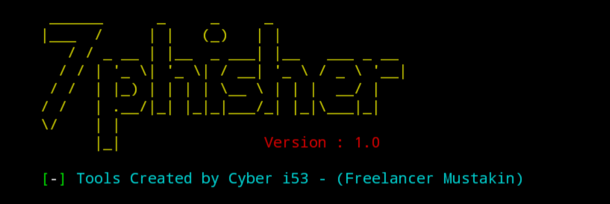
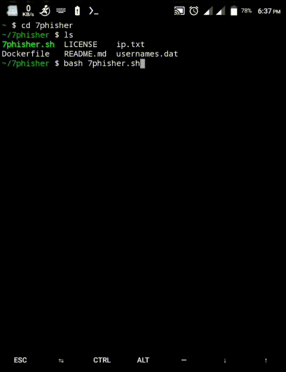

<!-- 7phisher -->

<p align="center">
 
</p>


<p align="center">7phisher is an automated phishing tool with 25+ templates.</p>

##

### Features

- Latest and updated login pages.
- URL support
- User friendly
- Docker support (checkout `docker-legacy` branch)
- Multiple tunneling options
  - Localhost
  - Ngrok (With or without hotspot)

##

### Installation

- Contact Us (Cyber i53)
  -`https://t.me/contactCyberi53`

- Just, Clone this repository -
```
$ git clone https://github.com/Cyberi53/7phisher

$ cd 7phisher
$ chmod +x 7phisher.sh
$ bash 7phisher.sh
```

- On first launch, It'll install the dependencies and that's it. `7phisher` is installed.

### Dependencies

**`7phisher`** requires following programs to run properly - 
- `pkg install python`
- `pkg install php`
- `pkg install wget`
- `pkg install curl`
- `pkg install git`
- `pkg install figlet`

> All the dependencies will be installed automatically when you run `7phisher` for the first time.

### Required Commands
- termux-setup-storage
- rm -rf (uninstall tools name)

> More Commands via `github: https://github.com/Cyberi53/tmklCommands`

### Supported Platform
**`Termux`**, **`Ubuntu/Debian/Kali`**, **`Arch Linux/Manjaro`**, **`Fedora`**

##

<h3 align="center">
:: How it works! ::
</h3>
<p align="center">

</p>

##

### Disclaimer :
Usage of `7phisher` for attacking targets without prior mutual consent is illegal. It's the end user's responsibility to obey all applicable local, state and federal laws. Developers assume no liability and are not responsible for any misuse or damage caused by this program.

##

### Special Thanks :

- [**AWWB**](https://facebook.com/awwbFoundation)
- [**jk -iTGuru**](https://github.com/jk-iTGuru)
- [**jkTECHDoctor**](https://github.com/jkTECHDoctor)
- [**Abdullah**](#)
- [**Emamul**](#)
- [**Freelancer Mustakin**](https://github.com/freelancermustakin)

##

### Donate!
> Donate a little money for helpless oppressed Muslims. The money you donate will only be used for Islam, InshaAllah.
- awwbFoundation (Donation)
  - `bKash: +8801944799794`
  - `Rocket: +8801944799794`
  - `Telegram: @contactAWWBfoundation`

> Or talk to Freelancer Mustakin, the founder of Cyber ​​I53. `via fb: www.facebook.com/freelancermustakin`

##

<h3 align="center">
Thank you all for being with us!
</h3>

<p align="center">Thank you all for being with us!.</p>
